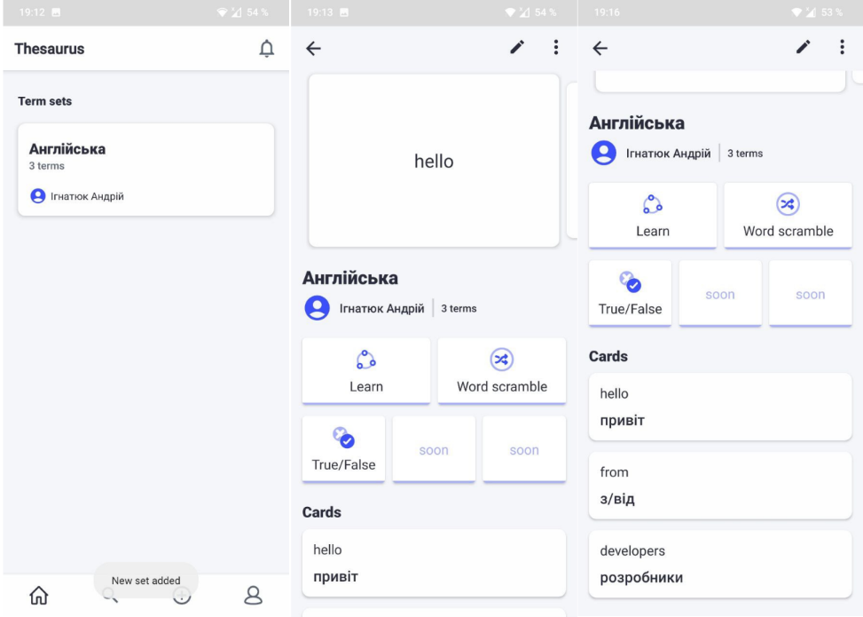

# Thesaurus

    <h3>Android application for learning languages.</h3>
    
UI was mostly (99%) scrapped from a Quizlet application and implemented from scratch for learning purposes.

    <h5>Visit Quizlet:</h5>
    <a href="https://quizlet.com/">Quizlet web</a> 
    <a href="https://play.google.com/store/apps/details?id=com.quizlet.quizletandroid&hl=ru&gl=US">Google Play</a>

<h5>Team members:</h5>
<ul>
    <li>Ігнатюк Андрій, УІ-191</li>
    <li>Кисельов Даніїл, УІ-191</li>
</ul>

<h3>Application demonstration:</h5>

</img>

</img>

</img>

</img>

</img>

</img>

</img>

</img>

</img>

